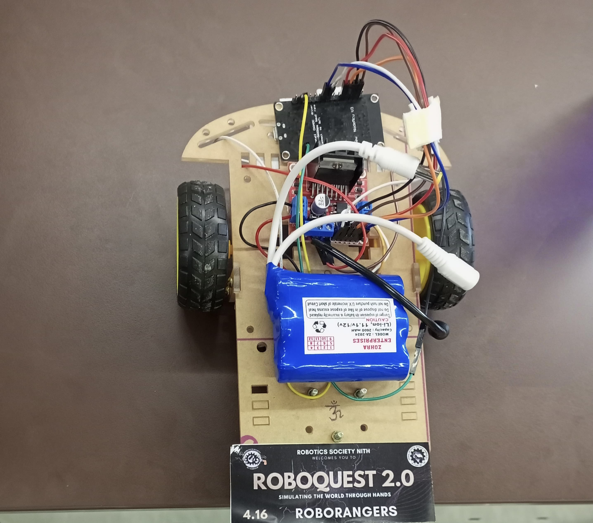

# Hand-Gesture-Controlled-Bot

markdown
Copy
Edit
# 🤖 Gesture Controlled Bot using OpenCV & MediaPipe



A robot controlled entirely using **hand gestures**, powered by **OpenCV** and **MediaPipe**. Show 1 to 5 fingers to move the bot forward, backward, left, right, or stop — no physical remote required!

🏆 **Winner of Roboquest 2.0 - Gesture Tech Challenge**  

---

## ✋ Gesture Controls

| Gesture | Fingers | Action         |
|---------|---------|----------------|
| ☝️       | 1       | Move Forward   |
| ✌️       | 2       | Move Backward  |
| 🤟      | 3       | Turn Left      |
| ✋       | 4       | Turn Right     |
| 🖐️       | 5       | Stop           |

Gestures are detected using a webcam and processed with **MediaPipe Hand Tracking**, then converted into movement commands which are wirelessly interpreted by the ESP8266 microcontroller to control the robot.

---

## ⚙️ Components Used

- 🔌 **ESP8266 NodeMCU**
- ⚡ **L298N Motor Driver**
- 🔋 **Battery Pack (7.4V or 12V)**
- 🧠 **Laptop/PC (Python script + camera)**
- 🎥 **Webcam (internal or USB)**
- 🔧 **DC Motors**
- 🧵 **Jumper Wires**

---

## 🛠️ Tech Stack

- Python 3
- OpenCV
- MediaPipe
- Arduino IDE (for ESP8266 firmware)

---
## 💻 How to Run

### On Your Laptop (Python + Camera)

1. Clone the repository:

    ```bash
    git clone https://github.com/ShubhmPathak02/Hand-Gesture-Controlled-Bot.git
    cd Hand-Gesture-Controlled-Bot
    ```

2. Install dependencies:

    ```bash
    pip install opencv-python mediapipe
    ```

3. Run the Python script:

    ```bash
    python main.py
    ```

This script will:
- Open your webcam  
- Detect hand gestures using MediaPipe  
- Count the number of fingers raised  
- Send numeric command signals (`1`, `2`, `3`, `4`, `5`) to the ESP8266 via wireless/serial interface

| Fingers Raised | Signal Sent | Action        |
|----------------|-------------|---------------|
| 1              | `1`         | Move Forward  |
| 2              | `2`         | Move Backward |
| 3              | `3`         | Turn Left     |
| 4              | `4`         | Turn Right    |
| 5              | `5`         | Stop          |

---

### On the ESP8266 (Arduino IDE)

1. Open `esp8266_gesturebot.ino` in **Arduino IDE**  
2. Select:
    - **Board:** `NodeMCU 1.0 (ESP-12E Module)`  
    - **Port:** (your correct COM port)  
3. Upload the code

The ESP8266 reads the numeric signals (`1` to `5`) and controls the motors via the **L298N motor driver** accordingly.

---


